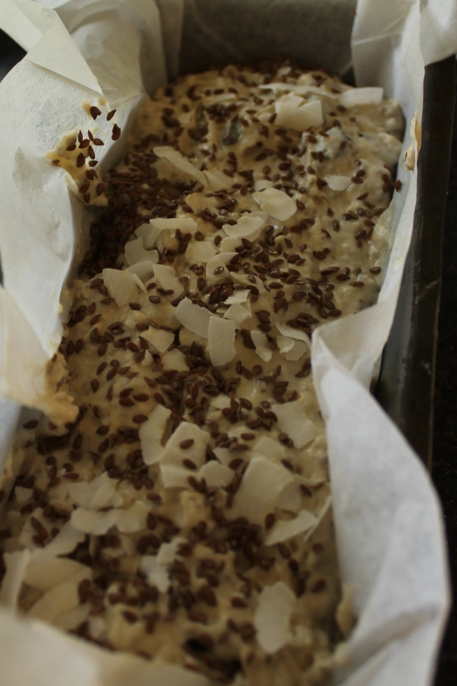

A family recipe that was passed down through the generations. Thank you for this one granny ^^  
Enjoy, this recipe is super flexible. In my family this recipe is known as the kitchen sink bread, go wild!

#### Ingredients

- 500g Nutty wheat flour (or combination of any flours)
- 500ml Butter milk (or equivalent yoghurt, milk and a squeeze of lemon)
- 1tbsp honey in a little hot water depending on how dry mixture is
- 1tsp Salt
- 1tsp Bicarbonate soda
- 1tsp Cream of tartar

Plus these additions (Options are flexible)

- 2 handfuls of sunflower seeds
- 1 handful of wheat germ
- 1 handful of bran  
  Can add nuts, seeds, dried fruit, coconut flakes etc. as you please

#### Recipe steps

1. Preheat oven to 180C
2. Put the dry ingredients in a bowl
3. Add the butter, milk and honey water
4. Mix well
5. Pour mix into loaf tin with baking paper
6. Place loaf in 180C oven for one hour
7. Bon Appétit!!!

